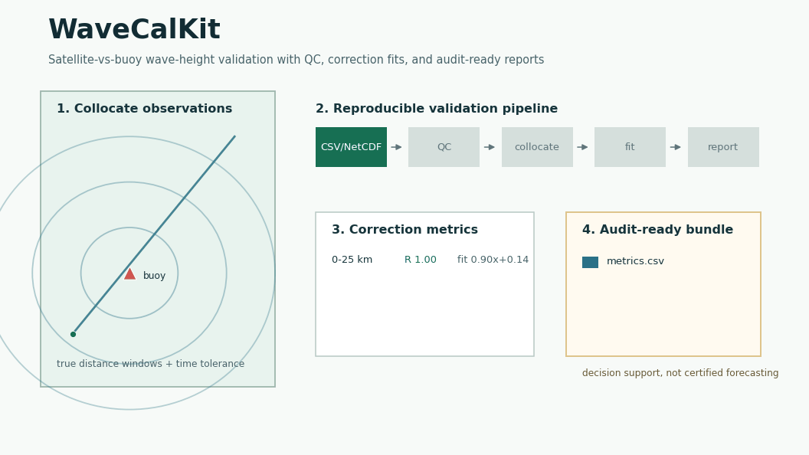

# WaveCalKit



WaveCalKit is a Python-native toolkit for satellite-altimeter significant wave-height validation against buoy observations. It turns normalized observation files into QC-filtered collocations, correction equations, figures, animations, tables, reports, and provenance that analysts can review and rerun.

## Who Buys It

WaveCalKit is built for B2B metocean work: offshore renewable developers, ports, coastal engineering teams, marine insurers, and due-diligence consultants that need a traceable satellite-vs-buoy evidence package for site screening, model validation, or technical reporting.

It is decision-support software, not certified forecasting, navigation safety software, a buoy-network replacement, or a bankable wave-energy yield product.

## What It Produces

The bundled sample is intentionally small and sanitized. It proves the workflow and output contract, not field-grade commercial accuracy.

| Window | N | R | Signed Bias m | MAE m | RMSE m | Fit |
|---|---:|---:|---:|---:|---:|---|
| 0-25 km | 8 | 1.000 | -0.135 | 0.145 | 0.177 | `altimeter = 0.90 * buoy + 0.14` |
| 25-50 km | 8 | 1.000 | -0.257 | 0.267 | 0.323 | `altimeter = 0.83 * buoy + 0.21` |
| 50-75 km | 8 | 1.000 | -0.215 | 0.223 | 0.268 | `altimeter = 0.86 * buoy + 0.17` |
| 75-100 km | 8 | 1.000 | -0.195 | 0.195 | 0.226 | `altimeter = 0.90 * buoy + 0.08` |

Example output bundle:

- `tables/collocations.csv`: matched satellite and buoy observations with distance, time delta, aggregation mode, and optional wave-power screening columns.
- `tables/metrics.csv`: correlation, signed bias, MAE, RMSE, scatter index, correction fit, confidence intervals, and mean wave-power screening values.
- `figures/*.png`: per-window scatter plots with fit lines.
- `workflow.gif` or `workflow.mp4`: animated validation dashboard covering map, scatter, polar, and 3D views.
- `report.md`: audit-ready narrative summary with claim boundaries.
- `provenance.json`: input paths, config, metric windows, and method notes.

See [docs/example_report.md](docs/example_report.md) for the generated report shape.

## Quick Start

Use the `dl` conda environment on this Mac, or install the package in any Python 3.11+ environment:

```bash
conda run -n dl python -m pytest
conda run -n dl python -m wavecal.cli run --config examples/scilly_jason3.yml --out outputs/scilly
```

The command writes reproducible tables, figures, a report, and a provenance file under `outputs/scilly/`.

## CLI

```bash
wavecal run --config examples/scilly_jason3.yml --out outputs/scilly
wavecal ingest-altimeter --source csv --input examples/data/scilly_altimeter_sample.csv --out outputs/altimeter.csv
wavecal ingest-buoy --source csv --input examples/data/scilly_buoy_sample.csv --out outputs/buoy.csv
wavecal collocate --altimeter-csv outputs/altimeter.csv --buoy-csv outputs/buoy.csv --station-lat 49.816667 --station-lon -6.545167 --aggregation nearest --out outputs/collocations.csv
wavecal fit --collocations outputs/collocations.csv --out outputs/metrics.csv
wavecal render-figures --collocations outputs/collocations.csv --metrics outputs/metrics.csv --out outputs/figures
wavecal report --metrics outputs/metrics.csv --collocations outputs/collocations.csv --out outputs/report.md
wavecal animate --config examples/scilly_jason3.yml --out outputs/scilly/workflow.gif --format gif
wavecal audit-release --mode tracked
```

## Python Reimplementation

Original desktop plotting and report steps now have Python CLI equivalents:

- static scatter figures: `wavecal render-figures`
- GIF/MP4 workflow animation: `wavecal animate`
- variable-sweep demo with optional `mpl-animator`:

```bash
pip install ".[visual]"
mpl-animator scripts/render_workflow_animation.py --var frame --range "0,2*pi" --frames 60 --out outputs/scilly/mpl_animator.gif
python render_workflow_animation_animated.py
```

The installed `mpl-animator` 0.1.x CLI generates an animated Python script first; running that emitted script writes the GIF or MP4. The animation examples use Matplotlib for 2D scatter, polar direction plots, subplots, and 3D distance-time-SWH views. Manim is documented as a future option for educational or marketing videos, not a v1 runtime dependency. See [docs/python_reimplementation.md](docs/python_reimplementation.md).

## Data Adapters

Current v1 supports normalized CSV, historical four-column TXT outputs, optional normalized `.xls` buoy workbooks, and optional user-supplied NetCDF altimeter files. Live Copernicus Marine, Cefas WaveNet, and NOAA NDBC download clients are documented targets; v1 asks users to normalize downloaded data to CSV or NetCDF until licensing, authentication, and provider-specific fields are wired in.

```bash
pip install ".[excel,netcdf]"
```

All external data remains subject to its own terms. The public repository redistributes only WaveCalKit code and sanitized fixtures.

## Commercial Boundary

WaveCalKit is valuable when a practitioner needs a repeatable validation package: what data was used, how it was filtered, what matched, which correction was fitted, and where the evidence is too thin. Stronger claims require multi-site validation, source-specific quality flags, licensing review, and independent holdout testing.
